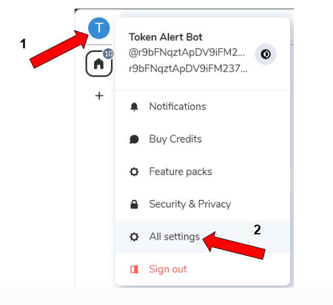
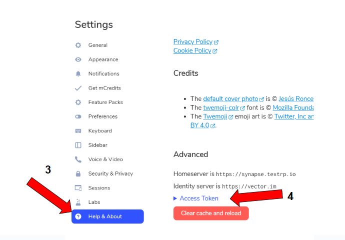

# TextRP Chatbot Template

A comprehensive Python chatbot template for [TextRP](https://textrp.io/). Features XRPL (XRP Ledger) wallet balance queries and weather information retrieval.

## Features

- **Full TextRP Support** - Complete implementation of TextRP room operations
- **XRP Wallet Integration** - TextRP user IDs are XRP wallet addresses
- **XRPL Wallet Queries** - Check XRP balances, account info, trust lines, NFTs, and more
- **Weather Information** - Fetch weather by city name or ZIP code via OpenWeatherMap API
- **Extensible Command System** - Easy-to-use decorators for adding custom commands
- **Production Ready** - Graceful shutdown, signal handling, and comprehensive logging

## Project Structure

```
textrp-chatbot/
├── main.py              # Main entry point with bot application
├── textrp_chatbot.py    # TextRP protocol client with all room methods
├── xrpl_utils.py        # XRPL client for wallet queries
├── weather_utils.py     # Weather API client
├── config.yaml          # Configuration template
├── .env.example         # Environment variables template
├── requirements.txt     # Python dependencies
└── README.md            # This file
```

## Quick Start

### 1. Clone and Install Dependencies

```bash
# Create virtual environment
python -m venv venv
source venv/bin/activate  # On Windows: venv\Scripts\activate

# Install dependencies
pip install -r requirements.txt
```

### 2. Configure Environment

Copy `.env.example` to `.env` and fill in your credentials:

```bash
cp .env.example .env
```

Edit `.env` with your settings:

```env
# TextRP Credentials
TEXTRP_HOMESERVER=https://synapse.textrp.io
TEXTRP_USERNAME=@yourbot:synapse.textrp.io
# TextRP uses access tokens, not passwords
TEXTRP_ACCESS_TOKEN=your_access_token
TEXTRP_DEVICE_NAME=TextRP Chatbot
TEXTRP_ROOM_ID=!yourroomid:synapse.textrp.io

# XRPL Configuration
XRPL_NETWORK=mainnet
# XRPL_RPC_URL is optional - uses default network endpoints if not set
# XRPL_RPC_URL=https://your-custom-rpc-endpoint.com

# Weather API (get free key at https://openweathermap.org/api)
WEATHER_API_KEY=your_openweathermap_api_key

# Bot Settings
BOT_COMMAND_PREFIX=!
BOT_LOG_LEVEL=INFO
# Token invalidation on shutdown (false = token stays valid across restarts)
INVALIDATE_TOKEN_ON_SHUTDOWN=false
```

### 3. Get TextRP Access Token

1. Click on your profile icon in the TextRP app
2. Select **All settings**



3. Click **Help & About** in the left sidebar
4. Click **Access Token** to reveal and copy your token



5. Add it to your `.env` file:
   ```env
   TEXTRP_ACCESS_TOKEN=your_actual_access_token_here
   ```

### 4. Run the Bot

```bash
python main.py
```

The bot will:
- Connect to TextRP
- Automatically accept room invitations
- Start responding to commands

## Bot Commands

| Command | Description | Example |
|---------|-------------|---------|
| `!help` | Show available commands | `!help` |
| `!ping` | Check if bot is online | `!ping` |
| `!whoami` | Show your TextRP ID and wallet | `!whoami` |
| `!balance [address]` | Check XRP wallet balance | `!balance rN7n3...` |
| `!wallet [address]` | Get detailed wallet info | `!wallet rN7n3...` |
| `!weather <location>` | Get current weather | `!weather New York` |
| `!forecast <location>` | Get weather forecast | `!forecast 90210` |

## TextRP Token Authentication

TextRP uses bearer token authentication:

1. **Obtain Access Token**: Get your token from the TextRP dashboard
   - Tokens start with `syt_` prefix
   - Tokens do not expire (server configured with `expire_access_token: False`)
   - Keep your token secure - it provides full access to your bot account

2. **Authentication Method**: 
   - The bot uses bearer token authentication directly
   - No password login or token refresh needed
   - Token is validated via the `/whoami` endpoint on startup

3. **Token Format**:
   ```
   TEXTRP_ACCESS_TOKEN=syt_cjliRk5xenRBcERWOWlGTTIzN0ZrRUhyQ1VtY1BndDV5eg_dbtiOrmdcyrKShXwgBFB_3ADm76
   ```

## Room Methods

The `TextRPChatbot` class provides comprehensive TextRP room operations:

### Room Management
```python
# Create rooms
room_id = await bot.create_room(name="My Room", topic="Discussion")
room_id = await bot.create_direct_message_room(user_id)

# Join/Leave
await bot.join_room("!roomid:server" or "#alias:server")
await bot.leave_room(room_id)
await bot.forget_room(room_id)
```

### Member Management
```python
# Invite, kick, ban users
await bot.invite_user(room_id, "@user:server")
await bot.kick_user(room_id, "@user:server", reason="Spam")
await bot.ban_user(room_id, "@user:server", reason="Violation")
await bot.unban_user(room_id, "@user:server")

# Get members
members = await bot.get_room_members(room_id)
count = await bot.get_room_member_count(room_id)
```

### Messaging
```python
# Send messages
await bot.send_message(room_id, "Hello!")
await bot.send_notice(room_id, "Bot notification")
await bot.send_emote(room_id, "waves hello")
await bot.send_html_message(room_id, "plain text", "<b>HTML</b>")

# Reactions and redactions
await bot.send_reaction(room_id, event_id, "👍")
await bot.redact_message(room_id, event_id, reason="Removed")
```

### Room State
```python
# Get/Set room properties
await bot.set_room_name(room_id, "New Name")
await bot.set_room_topic(room_id, "New Topic")
await bot.set_room_join_rules(room_id, "public")  # or "invite"
await bot.set_user_power_level(room_id, user_id, 50)  # Moderator

# Query state
name = await bot.get_room_name(room_id)
state = await bot.get_room_state(room_id)
power_levels = await bot.get_room_power_levels(room_id)
```

### Typing and Read Receipts
```python
await bot.send_typing(room_id, True)   # Start typing indicator
await bot.send_typing(room_id, False)  # Stop typing
await bot.mark_as_read(room_id, event_id)
```

### Media
```python
# Upload and send files
mxc_url = await bot.upload_file("path/to/file.png", "image/png")
await bot.send_image(room_id, "path/to/image.jpg")
await bot.send_file(room_id, "path/to/document.pdf")
```

### Profile
```python
await bot.set_display_name("My Bot Name")
await bot.set_avatar(mxc_url)
display_name = await bot.get_display_name(user_id)
```

## XRPL Integration

The `XRPLClient` provides comprehensive XRP Ledger queries:

```python
from xrpl_utils import XRPLClient

xrpl = XRPLClient(network="mainnet")

# Basic queries
balance = await xrpl.get_account_balance("rWalletAddress...")
info = await xrpl.get_account_info("rWalletAddress...")

# Validate addresses
is_valid = XRPLClient.is_valid_address("rWalletAddress...")

# Token balances (trust lines)
tokens = await xrpl.get_token_balances("rWalletAddress...")

# Transaction history
txs = await xrpl.get_account_transactions("rWalletAddress...", limit=10)

# NFTs
nfts = await xrpl.get_account_nfts("rWalletAddress...")

# Server info
server = await xrpl.get_server_info()
fee = await xrpl.get_current_fee()

# Formatted output for chat
summary = await xrpl.get_wallet_summary("rWalletAddress...")
```

## Weather Integration

The `WeatherClient` supports queries by city name or ZIP code:

```python
from weather_utils import WeatherClient, TemperatureUnit

weather = WeatherClient(
    api_key="your_api_key",
    units=TemperatureUnit.FAHRENHEIT  # or CELSIUS
)

# Current weather
data = await weather.get_weather_by_city("New York", "US")
data = await weather.get_weather_by_zip("10001", "US")
data = await weather.get_weather("New York")  # Auto-detects type

# Forecast
forecast = await weather.get_forecast("London", "GB", days=5)

# Formatted output for chat
message = weather.format_weather_message(data)
forecast_msg = weather.format_forecast_message(forecast)
```

## Adding Custom Commands

Use the decorator pattern to add new commands:

```python
@bot.textrp.on_command("mycommand")
async def cmd_mycommand(room, event, args):
    """
    Handle !mycommand
    
    Args:
        room: The TextRP room object
        event: The message event that triggered the command
        args: String of arguments after the command
    """
    await bot.textrp.send_message(
        room.room_id,
        f"You said: {args}"
    )
```

## Adding Event Handlers

Handle various TextRP events:

```python
from nio import RoomMessageText, RoomMemberEvent

@bot.textrp.on_event(RoomMessageText)
async def on_text_message(room, event):
    """Handle all text messages."""
    print(f"Message from {event.sender}: {event.body}")

@bot.textrp.on_event(RoomMemberEvent)
async def on_member_change(room, event):
    """Handle member join/leave events."""
    if event.membership == "join":
        print(f"{event.state_key} joined {room.display_name}")
```

## TextRP User ID Format

On TextRP, user IDs contain XRP wallet addresses:

```
@rN7n3473SaZBCG4dFL83w7a1RXtXtbk2D9:synapse.textrp.io
 │                                    │
 └── XRP Wallet Address               └── Homeserver
```

Extract wallet addresses using:

```python
wallet = bot.textrp.get_user_wallet_address(user_id)
# Returns: "rN7n3473SaZBCG4dFL83w7a1RXtXtbk2D9"
```

## API Keys

### OpenWeatherMap (Weather)

1. Sign up at [OpenWeatherMap](https://openweathermap.org/api)
2. Get your free API key from the dashboard
3. Set `WEATHER_API_KEY` in your `.env` file

### TextRP Account

Create a bot account on TextRP.

## Configuration Options

### Environment Variables

| Variable | Description | Default |
|----------|-------------|---------|
| `TEXTRP_HOMESERVER` | TextRP server URL | `https://synapse.textrp.io` |
| `TEXTRP_USERNAME` | Bot's TextRP user ID | Required |
| `TEXTRP_ACCESS_TOKEN` | Bot's access token | Required |
| `TEXTRP_DEVICE_NAME` | Device display name | `TextRP Bot` |
| `TEXTRP_ROOM_ID` | Default room to join | Optional |
| `INVALIDATE_TOKEN_ON_SHUTDOWN` | Whether to invalidate token on shutdown (true/false) | `false` |
| `XRPL_NETWORK` | XRPL network to use (mainnet/testnet/devnet) | `mainnet` |
| `XRPL_RPC_URL` | Custom XRPL RPC endpoint (optional) | Uses default endpoints |
| `WEATHER_API_KEY` | OpenWeatherMap API key for weather commands | Optional |
| `BOT_COMMAND_PREFIX` | Prefix for bot commands | `!` |
| `BOT_LOG_LEVEL` | Logging level (DEBUG/INFO/WARNING/ERROR) | `INFO` |

### Token Invalidation on Shutdown

The `INVALIDATE_TOKEN_ON_SHUTDOWN` flag controls whether the bot's access token is invalidated when the bot shuts down:

- **`false` (default)**: Token remains valid across restarts. More convenient for development.
- **`true`**: Token is invalidated on shutdown. More secure for production.

**Note**: When set to `true`, you'll need to generate a new token each time the bot restarts.

## Development

### Running Tests

```bash
# Test XRPL client
python xrpl_utils.py

# Test weather client
python weather_utils.py
```

### Logging

Set `BOT_LOG_LEVEL=DEBUG` for verbose output:

```bash
BOT_LOG_LEVEL=DEBUG python main.py
```

## Security Notes

- **Never commit `.env` files** - They contain sensitive credentials
- **Use environment variables** - Don't hardcode API keys
- **Limit bot permissions** - Only grant necessary power levels
- **Monitor bot activity** - Check logs regularly

## License

MIT License - See LICENSE file for details.

## Contributing

1. Fork the repository
2. Create a feature branch
3. Make your changes with tests
4. Submit a pull request

## Support

- **TextRP**: Join the TextRP community for support
- **Issues**: Open an issue on GitHub
- **Documentation**: See inline code comments for detailed API docs
